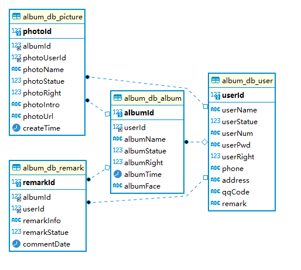

<!-- TOC tocDepth:2..3 chapterDepth:2..6 -->

- [引言](#引言)
- [项目架构](#项目架构)
- [Database's Design](#databases-design)
    - [表名：album_db_album](#表名：albumdbalbum)
    - [表名：album_db_picture](#表名：albumdbpicture)
    - [表名：album_db_remark](#表名：albumdbremark)
    - [表名：album_db_user](#表名：albumdbuser)
- [功能设计](#功能设计)
    - [游客模块](#游客模块)
    - [用户模块](#用户模块)
    - [管理员模块](#管理员模块)
- [项目结构分析](#项目结构分析)
    - [controller](#controller)
    - [service](#service)
    - [mapper](#mapper)
- [项目部署](#项目部署)
    - [修改配置](#修改配置)
    - [启动项目](#启动项目)

<!-- /TOC -->

## 引言

网络相册管理系统是实现用户在线管理网络相册的简易有效的系统，该系统提供了一个以存储、管理照片为核心的用户交流平台，既能够让用户展示个人风采，还能够增加用户之间交流的可能性。

## 项目架构

项目整体使用前后端分离的机制。

前端没有使用工程化来创建项目 ，所以为了保证前端公共模块的 **复用**，后端使用了 **thymeleaf** 模板引擎。


## Database's Design

数据库这里使用 Mysql，版本为 8.0.26-0ubuntu0.20.04.2（运行在 Ubuntu20.04 上）

E-R 图



​					

### 表名：album_db_album

| 注释： | 相册信息表         | 引擎： | InnoDB     |
| ------ | ------------------ | ------ | ---------- |
| 编码： | utf8mb4_0900_ai_ci | 类型： | BASE TABLE |

 

| **序号** | **字段名称** | **字段描述**                 | **字段类型** | **长度** | **允许空** | **缺省值** |
| -------- | ------------ | ---------------------------- | ------------ | -------- | ---------- | ---------- |
| 1        | albumId      | 相册编号 主键                | int          | null     | NO         | null       |
| 2        | userId       | 所属用户编号 外键            | int          | null     | YES        | null       |
| 3        | albumName    | 相册名称                     | varchar      | 100      | YES        | null       |
| 4        | albumStatue  | 相册状态、1有效，0禁用       | int          | null     | YES        | null       |
| 5        | albumRight   | 相册权限、1可访问，0不可访问 | int          | null     | YES        | null       |
| 6        | albumTime    | 相册创建时间                 | datetime     | null     | YES        | null       |
| 7        | albumFace    | 相册封面                     | varchar      | 100      | YES        | null       |

 

### 表名：album_db_picture

| 注释： | 照片信息表         | 引擎： | InnoDB     |
| ------ | ------------------ | ------ | ---------- |
| 编码： | utf8mb4_0900_ai_ci | 类型： | BASE TABLE |

 

| **序号** | **字段名称** | **字段描述**                 | **字段类型** | **长度** | **允许空** | **缺省值** |
| -------- | ------------ | ---------------------------- | ------------ | -------- | ---------- | ---------- |
| 1        | photoId      | 照片编号 主键                | int          | null     | NO         | null       |
| 2        | albumId      | 相册编号 外键                | int          | null     | YES        | null       |
| 3        | photoUserId  | 图片所属用户的ID 外键        | int          | null     | YES        | null       |
| 4        | photoName    | 照片名称                     | varchar      | 100      | YES        | null       |
| 5        | photoStatue  | 照片状态 1有效，0禁用        | int          | null     | YES        | null       |
| 6        | photoRight   | 照片权限 1可访问，0 不可访问 | int          | null     | YES        | null       |
| 7        | photoIntro   | 照片详情说明（图片描述）     | varchar      | 400      | YES        | null       |
| 8        | photoUrl     | 照片路径                     | varchar      | 400      | YES        | null       |
| 9        | createTime   | 图片上传时间                 | datetime     | null     | YES        | null       |

 

 

### 表名：album_db_remark

| 注释： | 评论信息表         | 引擎： | InnoDB     |
| ------ | ------------------ | ------ | ---------- |
| 编码： | utf8mb4_0900_ai_ci | 类型： | BASE TABLE |

 

| **序号** | **字段名称** | **字段描述**                         | **字段类型** | **长度** | **允许空** | **缺省值** |
| -------- | ------------ | ------------------------------------ | ------------ | -------- | ---------- | ---------- |
| 1        | remarkId     | 评论编号、主键                       | int          | null     | NO         | null       |
| 2        | albumId      | 相册编号 外键                        | int          | null     | YES        | null       |
| 3        | userId       | 发布评论的用户ID 外键                | int          | null     | YES        | null       |
| 4        | remarkInfo   | 评论信息                             | varchar      | 100      | YES        | null       |
| 5        | remarkStatue | 评论状态 （0 等待审核 1 审核完成  ） | int          | null     | YES        | null       |
| 6        | commentDate  | 评论发布时间                         | datetime     | null     | YES        | null       |

 

 

### 表名：album_db_user

| 注释： | 用户信息表：普通用户和管理员 | 引擎： | InnoDB     |
| ------ | ---------------------------- | ------ | ---------- |
| 编码： | utf8mb4_0900_ai_ci           | 类型： | BASE TABLE |

 

| **序号** | **字段名称** | **字段描述**            | **字段类型** | **长度** | **允许空** | **缺省值** |
| -------- | ------------ | ----------------------- | ------------ | -------- | ---------- | ---------- |
| 1        | userId       | 用户编号 主键           | int          | null     | NO         | null       |
| 2        | userName     | 用户昵称                | varchar      | 100      | YES        | null       |
| 3        | userStatue   | 用户状态 1有效，0禁用   | int          | null     | YES        | null       |
| 4        | userNum      | 用户帐号                | varchar      | 100      | YES        | null       |
| 5        | userPwd      | 用户密码                | varchar      | 100      | YES        | null       |
| 6        | userRight    | 用户权限 1管理员，0用户 | int          | null     | YES        | null       |
| 7        | phone        | 用户电话                | varchar      | 30       | YES        | null       |
| 8        | address      | 用户地址                | varchar      | 100      | YES        | null       |
| 9        | qqCode       | 用户QQ                  | varchar      | 30       | YES        | null       |
| 10       | remark       | 用户备注                | varchar      | 100      | YES        | null       |

 

## 功能设计

### 游客模块

1. 访问公开、通过管理员审核的相册、查询公开的图片
2. 注册账号

### 用户模块

1. 创建相册，添加图片
2. 发布评论

### 管理员模块

1. 管理用户
2. 管理、审核相册
3. 管理、审核图片
4. 管理、审核评论


## 项目结构分析

项目是一套通用的项目组织结构
- controller 处理请求
- service 处理业务逻辑
- mapper 数据库操作

不同层下的对应的实体类直接的转换手动进行，推荐使用对应的  **转换工具** 来进行

> 在复杂的项目中，可以更加细分为不同模块

除去上面的层次，这里介绍其它包的作用

- config 配置。这里主要进行拦截器的配置
- annotation 自定义注解。实现手动的权限认证，配置拦截器使用
- interceptor 拦截器。项目中使用到的拦截器
- utils 工具类

### controller

主要功能是处理前端请求，调用其它模块（类）来处理前端请求，返回 JSON 数据类型给前端；前端使用 Vue 渲染界面。主要负责的工作为：
1. 前端请求参数封装、请求参数格式校验
2. 前端请求权限认证

- 请求参数格式的校验是手动进行校验的，这里推荐替换成 validation 
- 权限认证：手动认证，推荐替换成 shiro 

> controller 层对应的实体类在 model.vo 包下


### service

处理业务逻辑

### mapper

这里使用的 mybatis 框架来处理和数据库相关的操作

> 和这一层相关的实体类在 **entity** 包下

## 项目部署

### 修改配置

修改和mysql数据库相关的配置和图片保存位置的配置

> 可以在项目的启动中配置 图片保存的位置

### 启动项目

```bash
java -jar album-0.0.6.jar
```

或者

```bash
java  -Dimage.path=image -Dimage.face=faceimage -jar album-0.0.6.jar
```


